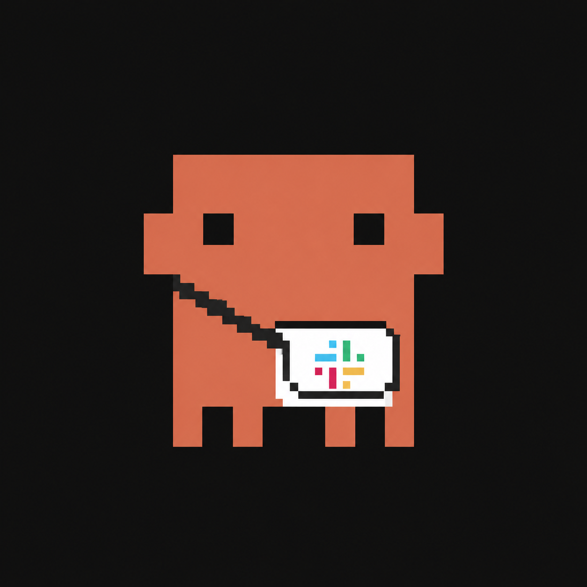

<p align="center">
  
</p>

# cc-agent-messenger

[English](README.md) | **日本語**

[](https://pypi.org/project/cc-agent-messenger/)
[](https://pypi.org/project/cc-agent-messenger/)
[](https://github.com/noboru2000/cc-agent-messenger/actions/workflows/ci.yml)
[](LICENSE)

Mac の VS Code で AI コーディングエージェントが作業を続けている間に、**iPhone の
Slack** から状況確認・次の選択・完了通知などをやり取りできるツールです。常駐 bot が
Slack チャネルと**ライブの Claude Code セッション**(および Codex / Copilot のヘッド
レス CLI)を橋渡しします。**完結したメッセージ単位**のやり取りで、ターミナルのライブ
ミラーリングではありません。

> ⚠️ **セキュリティと自己責任。** 本ツールは Slack メッセージに応じてコマンドを実行
> します(RCE 隣接)。**単一の信頼できるオペレータ**が信頼できるマシンで使う前提です。
> ハンズフリー自動返信を有効化すると、返信コマンドの自動実行を許可することになります
> (意識的に受け入れるリスク)。無保証・自己責任。[SECURITY.md](SECURITY.md) 参照。

```text
iPhone Slack ──(@bot / /status)──► 常駐 bot (Bolt + Socket Mode)
                                       │ 認可(NN4)+ コマンド照合
                                       ▼
                               tmp/.slack_message  ◄── tail -f Monitor(ライブ Claude セッション)
          iPhone プッシュ ◄── bot chat.postMessage ◄── cc-agent-messenger send(Unix socket 送信 API)
```

## 何ができるか

- **受信:** プライベートチャネルのメッセージを認可しローカルファイルに追記。`tail -f`
  で監視中のライブ Claude Code セッションが起床し、コマンドを解釈して返信。
- **送信:** 返信は**自前 bot** があなたを `@mention` して投稿 → スマホにプッシュ。
- **エージェント:** Claude Code は**ライブセッション(C0)**、Codex/Copilot は**ヘッド
  レス CLI(C1)**。Claude も C1 可。

## 必要環境

- macOS または Linux/WSL、VS Code + Claude Code 拡張、Python ≥ 3.11、`uv`。
- Slack ワークスペース + あなた専用の**プライベートチャネル**、Socket Mode の Slack アプリ。
- Codex/Copilot を使う場合は各 CLI の導入+認証(`codex`、`@github/copilot`)。Claude の
  C0 は追加 CLI 不要。

## インストール

    uv tool install cc-agent-messenger
    # ソースから:
    uv tool install git+https://github.com/noboru2000/cc-agent-messenger

## クイックスタート

    cd your-project
    cc-agent-messenger init          # skill / 設定テンプレ / .gitignore / allowlist を配置
    # 1) Slack アプリ作成(Socket Mode + スコープ + Event Subscriptions);docs/SETUP.md
    # 2) .cc-agent-messenger/config.toml にトークン + チャンネル ID を記入
    cc-agent-messenger daemon        # 常駐 bot 起動

    cc-agent-messenger ping          # -> {"status":"alive"}
    cc-agent-messenger send --text "テスト"   # -> チャネルに投稿、スマホにプッシュ

その後、VS Code の Claude Code セッションで **`cc-agent-messenger`** スキルを起動して
待ち受け開始。`init` が表示する allow ルールを `.claude/settings.json` に貼ると
ハンズフリーになります。

## コマンド

`cc-agent-messenger <init | uninstall | daemon | send | ping | status | stop | kill on|off | doctor>`
— 詳細は `cc-agent-messenger --help`。Slack からは `/help`、`/status`、`/options`、
`/continue`、`/doctor`、または `@bot <メッセージ>` — 全コマンドは
[docs/USAGE.md](docs/USAGE.md) を参照。

## 制限

- **セッション束縛:** ライブ(C0)ブリッジは VS Code と Mac が起きていてスキルの監視が
  動いている間のみ。24/7 サービスではありません。
- Copilot/Codex の返信は**ヘッドレス CLI ターン**で、VS Code の GUI パネルとは別文脈です。

## ドキュメント

- [docs/SETUP.md](docs/SETUP.md) — Slack アプリ作成・招待・設定・起動・E2E・トラブルシュート。
- [docs/USAGE.ja.md](docs/USAGE.ja.md) — Slack コマンドリファレンス(`/help`・`/status` 等)・
  キーワード・起動後の期待動作。
- [docs/ARCHITECTURE.md](docs/ARCHITECTURE.md) — C0 ループ・egress chokepoint・4入力面・
  セキュリティモデル。

## ライセンス・作者

[MIT](LICENSE) © 2026 Noboru Harada。

**作者・メンテナ:** Noboru Harada &lt;noboru@ieee.org&gt;。脆弱性報告は
[SECURITY.md](SECURITY.md)、不具合・要望は
[Issue](https://github.com/noboru2000/cc-agent-messenger/issues) へ。
